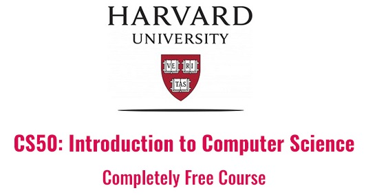
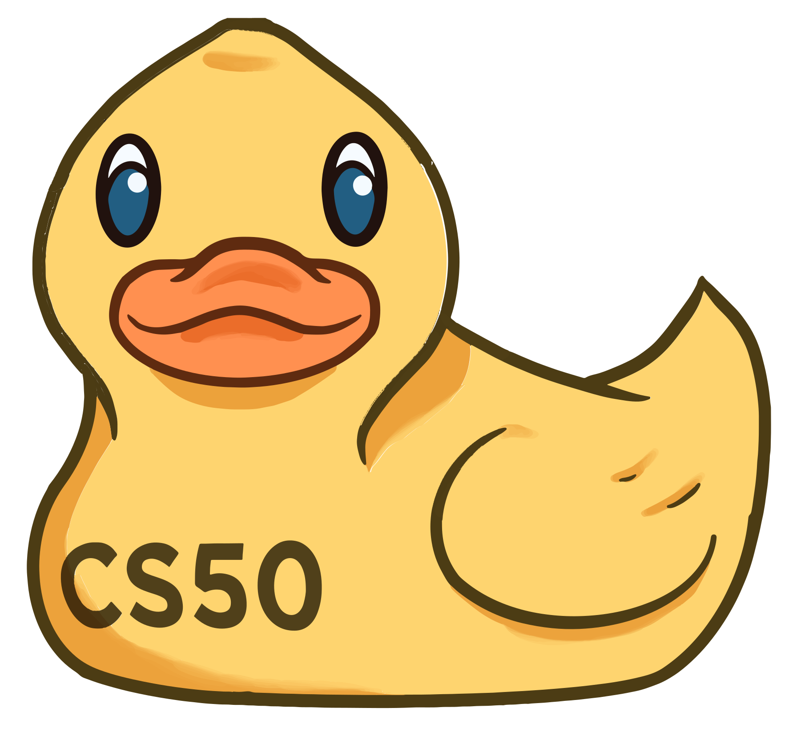

# CS50
 
**CC50** - Introdução à Ciência da Computação.  
**CS50** - Computer Science 50. 

  
  

### 12 semanas - 6 a 18 horas por semana (216 horas) 

**Instituição:**  HarvardX  
**Assunto:**  Ciência da Computação   
**Nível:**  Introdutório  
**Pré requisitos:**  Não  
**Linguagem:** English  
**Legendas:** Habilitar legenda automática do youtube para os vídeos e tradução dos textos com a [Extensão do Google Tradutor](https://chrome.google.com/webstore/detail/google-translate/aapbdbdomjkkjkaonfhkkikfgjllcleb?hl=pt)

 
&nbsp;IDE Online
# Grade do Curso:
[Introdução](introducao.md)  
